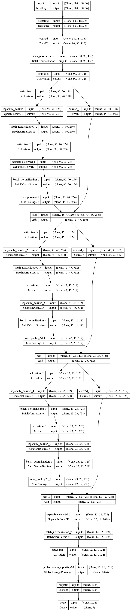
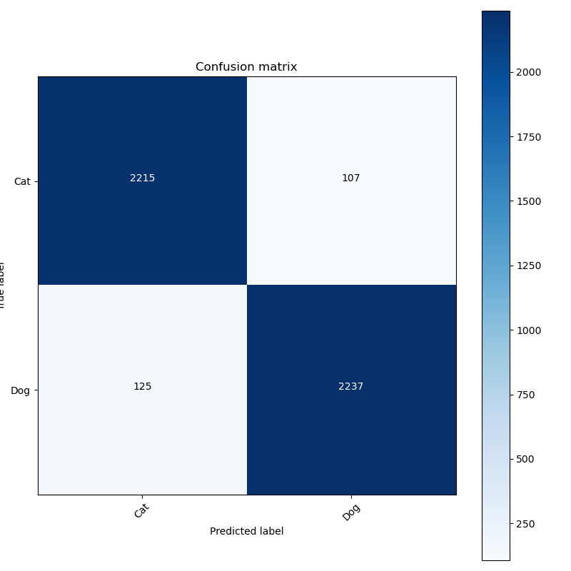

# Multiclass classification model

## Description

This project implements a categorical classification model using Python. The model is designed to perform a multi class classification based on the input data.

## Installation
Ensure newest version of python and pip are installed previous to these steps
1. Clone the repository:

    ```bash
    git clone https://github.com/Kijalx/FYP.git
    ```

2. Navigate to the project directory:

    ```bash
    cd FYP
    ```

3. Install the required dependencies: (or run setup.bat)

    ```bash
    pip install -r requirements.txt
    ```

## Usage

1. Ensure that the required dependencies are installed by running the installation steps mentioned above.
   
3. Download cats and dogs dataset
   ```bash
    curl -O https://download.microsoft.com/download/3/E/1/3E1C3F21-ECDB-4869-8368-6DEBA77B919F/kagglecatsanddogs_5340.zip
    ```

5. Run the binary classification model:

    ```bash
    python main.py
    ```

## Requirements

- Python 3.x
- Libraries listed in requirements.txt

## Acknowledgments

- Aleks Kijewski




